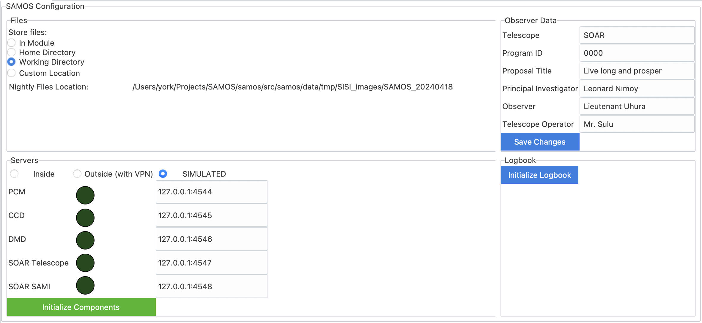
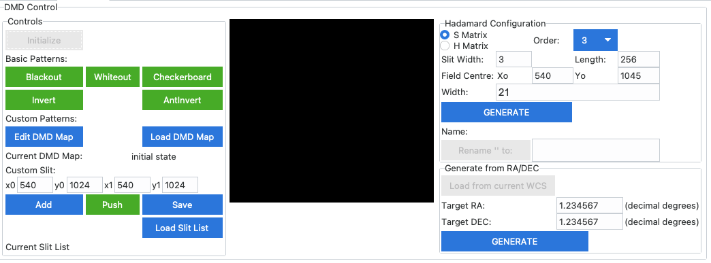

SAMOS Control Software
######################

This repository contains control software for the SAMOS combined imaging/spectroscopic 
multi-mirror instrument. The 
`SAMOS User Manual <https://www.overleaf.com/5144243873krfgcykcycjz#91ea30>`_
is available online.

Installation and Setup
**********************

SAMOS is intended to be installed by cloning this repository. The easiest way to set up 
the SAMOS software (and interface) is as follows::

    $> git clone https://github.com/mrobberto/SAMOS_NEWGUI
    $> cd SAMOS_NEWGUI
    $> conda env create -f environment.yml
    $> conda activate samos
    $> run_samos

As can be seen above, the default method of creating and running SAMOS requires some 
variant of `Anaconda <https://docs.conda.io/projects/conda/en/stable/>`_ to be installed.
However, SAMOS should also be installable with `pip` as follows::

    $> git clone https://github.com/mrobberto/SAMOS_NEWGUI
    $> pip install SAMOS_NEWGUI
    $> run_samos

In this case, you will need to have python installed.

Interface Conventions
*********************

SAMOS is built using tkinter for its GUI, and 
`ttkbootstrap <https://ttkbootstrap.readthedocs.io/en/latest/>`_ for its interface 
theming. Currently, SAMOS uses the 
`cosmo <https://ttkbootstrap.readthedocs.io/en/latest/themes/light/>`_ theme.

.. image:: https://ttkbootstrap.readthedocs.io/en/latest/assets/themes/cosmo.png

In general, SAMOS adopts the following UI conventions:

* Interface elements that allow choices to be made, or that affect the state of the SAMOS
  GUI itself, without changing the state of the hardware[1]_, use the Primary colour.
* Interface elements that send messages to the hardware in order to receive back status 
  information, but which should not themselves affect the hardware state, use the Info
  colour.
* Interface elements that send commands to the hardware use the Success colour
* Interface elements that send commands that are unlikely to come up in standard operation
  use the Warning colour
* Interface elements that send commands that should only be used if you're certain of what
  you're doing (and that it needs to be done) use the Danger colour

Interface Tabs
**************

Configuration Tab
=================

The Configuration tab allows for changes to the application configuration, as well as 
quick monitoring of the hardware components. There are 4 main sections in the 
configuration interface.

Files
-----

This allows the user to set where SAMOS images and nightly configurations will be stored.
The value of this setting is stored by SAMOS internally in the data/system directory in 
the file preferences.yaml. The possible values are:

* In module: in this case, SAMOS will store images and nightly parameters within the 
  module directory itself, specifically in a directory named SISI_images in the data/tmp
  directory.[2]_
* Home directory: in this case, SAMOS will store images and nightly parameters in the
  user's home directory, again in a directory named SISI_images
* Working directory: in this case, SAMOS will create the SISI_images directory, and any 
  nightly directories within it, in the same directory from which `run_samos` was 
  invoked.
* Custom directory: this allows the user to set the base directory where SISI_images will 
  be created.

SAMOS uses the `SAMOS_FILES_LOCATION` and `SAMOS_CUSTOM_FILES_LOCATION` environment 
variables to store information about the selected value of files, and setting those 
environment variables before launching SAMOS will set the value that SAMOS will use to 
populate the files tab. Setting the environment variables before launch will override any 
value stored in the preferences.yaml file.

Observer Data
-------------

This data is taken from (and saved to) the Parameters of the Night (PotN) file (found on 
disk as parameters_of_the_night.yaml). SAMOS stores a default PotN file in its 
data/system directory but, on launch, will copy that file to the currently nightly data 
directory ($SAMOS_FILES_LOCATION/SISI_images/SAMOS_<date>/) if no such file exists in that 
directory. Any changes made to the values in the configuration tab will be saved to the 
nightly file, rather than to the defaults file, and if you create a nightly file before 
launching SAMOS, then the values in that file will be used to populate these tabs.

Servers
-------

This frame allows the user to set the IP addresses at which the SAMOS components can be 
found, and also allows the user to select whether the hardware is found on the same 
network as the user (inside), over a VPN (outside with VPN), or should be simulated by 
the application (SIMULATED). In the case of simulated operation, all IP addresses must be 
set to the local loopback address of 127.0.0.1. The coloured circles in the interface 
show the status of the components (dark green for off/unknown, bright green for on, 
magenta for currently processing a command), and the "Initialize Components" button allows 
the user to attempt to make network connections to all of the SAMOS hardware components,
initialize them, and display their status. Using this button is the equivalent of using 
the "Initialize" button on all of the hardware tabs individually.

Logbook
-------

This frame either allows the user to create a nightly logbook (if none exists) or shows 
the location of the current nightly logbook (if one already exists).

DMD Tab
=======

The DMD tab allows the user to select and generate DMD configurations. While some of the 
basic functionality can be found on the main tab, fine control over the DMD pattern is 
best done on this tab. The DMD tab has three major frames, and one display area.

Controls
--------

This frame allows the DMD connection to be initialized (and most DMD functions will not be 
available until the hardware has been initialized), allows basic DMD patterns to be set, 
allows DMD maps to be loaded and saved, and allows DMD patterns to be pushed to the 
hardware. The following basic patterns are available:

* Blackout sets all mirrors to the spectroscopic channel (and they are therefore "off" to
  the imaging channel).
* Whiteout sets all mirrors to the imaging channel (and they are therefore "off" to the 
  spectroscopic channel)
* Invert inverts the current pattern, and sets the "inverted" flag to True
* Antinvert also inverts the current pattern, and sets the "inverted" flag to False

The checkerboard pattern is not currently stored in the DMD as a quick pattern, and so 
although the selection button is available, it is disabled by default.

In addition to the basic pattern sets, there are also advanced pattern features.

* The "Edit DMD Map" button asks the user to select a pattern file, and attempts to open 
  it in the default available text editor. It is provided primarily as a convenience.
* The "Load DMD Map" button loads an existing pattern file and sends it to the DMD as a 
  commanded pattern.

.. [1] Although they may affect what parameters are later sent to the hardware. For 
   example, selecting a filter or grism setting in the main page does not command the 
   hardware, but does affect the command that will be sent if the corresponding "set" 
   button is clicked.

.. [2] Note that the SAMOS repository is set so that files in data/tmp will not be 
   tracked by version control.
