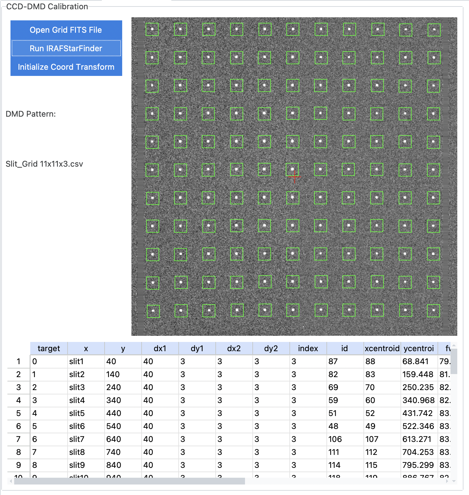
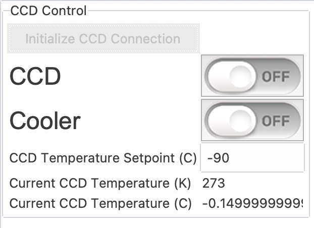

SAMOS Control Software
######################

This repository contains control software for the SAMOS combined imaging/spectroscopic 
multi-mirror instrument. The 
`SAMOS User Manual <https://www.overleaf.com/5144243873krfgcykcycjz#91ea30>`_
is available online.

Installation and Setup
**********************

SAMOS is intended to be installed by cloning this repository. The easiest way to set up 
the SAMOS software (and interface) is as follows::

    $> git clone https://github.com/mrobberto/SAMOS_NEWGUI
    $> cd SAMOS_NEWGUI
    $> conda env create -f environment.yml
    $> conda activate samos
    $> run_samos

As can be seen above, the default method of creating and running SAMOS requires some 
variant of `Anaconda <https://docs.conda.io/projects/conda/en/stable/>`_ to be installed.
However, SAMOS should also be installable with `pip` as follows::

    $> git clone https://github.com/mrobberto/SAMOS_NEWGUI
    $> pip install SAMOS_NEWGUI
    $> run_samos

In this case, you will need to have python installed.

Interface Conventions
*********************

SAMOS is built using tkinter for its GUI, and 
`ttkbootstrap <https://ttkbootstrap.readthedocs.io/en/latest/>`_ for its interface 
theming. Currently, SAMOS uses the 
`cosmo <https://ttkbootstrap.readthedocs.io/en/latest/themes/light/>`_ theme.

.. image:: https://ttkbootstrap.readthedocs.io/en/latest/assets/themes/cosmo.png

In general, SAMOS adopts the following UI conventions:

* Interface elements that allow choices to be made, or that affect the state of the SAMOS
  GUI itself, without changing the state of the hardware[1]_, use the Primary colour.
* Interface elements that send messages to the hardware in order to receive back status 
  information, but which should not themselves affect the hardware state, use the Info
  colour.
* Interface elements that send commands to the hardware use the Success colour
* Interface elements that send commands that are unlikely to come up in standard operation
  use the Warning colour
* Interface elements that send commands that should only be used if you're certain of what
  you're doing (and that it needs to be done) use the Danger colour

Interface Tabs
**************

Configuration Tab
=================

The Configuration tab allows for changes to the application configuration, as well as 
quick monitoring of the hardware components. There are 4 main sections in the 
configuration interface.

Files
-----

This allows the user to set where SAMOS images and nightly configurations will be stored.
The value of this setting is stored by SAMOS internally in the data/system directory in 
the file preferences.yaml. The possible values are:

* In module: in this case, SAMOS will store images and nightly parameters within the 
  module directory itself, specifically in a directory named SISI_images in the data/tmp
  directory.[2]_
* Home directory: in this case, SAMOS will store images and nightly parameters in the
  user's home directory, again in a directory named SISI_images
* Working directory: in this case, SAMOS will create the SISI_images directory, and any 
  nightly directories within it, in the same directory from which `run_samos` was 
  invoked.
* Custom directory: this allows the user to set the base directory where SISI_images will 
  be created.

SAMOS uses the `SAMOS_FILES_LOCATION` and `SAMOS_CUSTOM_FILES_LOCATION` environment 
variables to store information about the selected value of files, and setting those 
environment variables before launching SAMOS will set the value that SAMOS will use to 
populate the files tab. Setting the environment variables before launch will override any 
value stored in the preferences.yaml file.

Observer Data
-------------

This data is taken from (and saved to) the Parameters of the Night (PotN) file (found on 
disk as parameters_of_the_night.yaml). SAMOS stores a default PotN file in its 
data/system directory but, on launch, will copy that file to the currently nightly data 
directory ($SAMOS_FILES_LOCATION/SISI_images/SAMOS_<date>/) if no such file exists in that 
directory. Any changes made to the values in the configuration tab will be saved to the 
nightly file, rather than to the defaults file, and if you create a nightly file before 
launching SAMOS, then the values in that file will be used to populate these tabs.

Servers
-------

This frame allows the user to set the IP addresses at which the SAMOS components can be 
found, and also allows the user to select whether the hardware is found on the same 
network as the user (inside), over a VPN (outside with VPN), or should be simulated by 
the application (SIMULATED). In the case of simulated operation, all IP addresses must be 
set to the local loopback address of 127.0.0.1. The coloured circles in the interface 
show the status of the components (dark green for off/unknown, bright green for on, 
magenta for currently processing a command), and the "Initialize Components" button allows 
the user to attempt to make network connections to all of the SAMOS hardware components,
initialize them, and display their status. Using this button is the equivalent of using 
the "Initialize" button on all of the hardware tabs individually.

Logbook
-------

This frame either allows the user to create a nightly logbook (if none exists) or shows 
the location of the current nightly logbook (if one already exists).

DMD Tab
=======

.. image:: src/samos/data/documentation/images/dmd.png

The DMD tab allows the user to select and generate DMD configurations. While some of the 
basic functionality can be found on the main tab, fine control over the DMD pattern is 
best done on this tab. The DMD tab has three major frames, and one display area.

Controls
--------

This frame allows the DMD connection to be initialized (and most DMD functions will not be 
available until the hardware has been initialized), allows basic DMD patterns to be set, 
allows DMD maps to be loaded and saved, and allows DMD patterns to be pushed to the 
hardware. The following basic patterns are available:

* Blackout sets all mirrors to the spectroscopic channel (and they are therefore "off" to
  the imaging channel).
* Whiteout sets all mirrors to the imaging channel (and they are therefore "off" to the 
  spectroscopic channel)
* Invert inverts the current pattern, and sets the "inverted" flag to True
* Antinvert also inverts the current pattern, and sets the "inverted" flag to False

The checkerboard pattern is not currently stored in the DMD as a quick pattern, and so 
although the selection button is available, it is disabled by default.

In addition to the basic pattern sets, there are also advanced pattern features.

* The "Edit DMD Map" button asks the user to select a pattern file, and attempts to open 
  it in the default available text editor. It is provided primarily as a convenience.
* The "Load DMD Map" button loads an existing pattern file and sends it to the DMD as a 
  commanded pattern.

Finally, if the DMD is operating from a slit list, the "Custom Slits" frame allows you to 
add new slits to the list, load a list of slits, save a list of slits, or push the 
current slit list to the DMD. In particular,

* The "x0", "y0", "x1", and "y1" test entry areas allow a custom slit to be defined in DMD
  co-ordinate space. The slit so defined can be used as the base to create a new slit file,
  or added to an existing slit file.
* The "Add" button adds the custom slit entry to the current slit file (if one exists)
* The "Push" button pushes the current slit file to the DMD
* The "Save" button saves any changes to the current slit file
* The "New Slit List" button creates a new slit file, including the currently defined 
  custom slit
* The "Load Slit List" button loads a slit list from a file

DMD CCD Mapping Tab
===================

The DMD/CCD mapping tab is intended to allow the mapping between DMD mirrors and CCD 
pixels to be established, checked, and updated. In order to check the mapping, you need:

* A FITS file, taken with the CCD, where the corresponding DMD map is known (and has been
  added to the primary FITS header with the keyword "DMDMAP").
* The corresponding DMD map, as a CSV file

The mapping is done by loading the FITS file, running star-finding code to identify 
sources in the image, and running WCS fitting code to convert the image positions to a
WCS mapping based on the DMD pattern.

None of the functions in this tab act on the SAMOS hardware in any way. Instead, they 
update the DMD_Mapping_WCS.fits file (which contains the mapping WCS in its header, from
which it can be loaded as an astropy WCS), which is kept in the SAMOS data directory at
data/dmd/pixel_mapping.

Motors Tab
==========

The motors tab allows the user to connect to the PCM module, get step information from the
filter wheels and grating rails, move the wheels/rails to specific positions, and 
initialize the set step values for the filters and gratings.

The "Initialize" button attempts to open a connection to the PCM and, if successful, 
queries the current PCM power status. The motor power button powers the motors on or off.
And the power port status button gets the reported status of all of the power ports of 
the PCM.

Filter/Grating Control
----------------------

Along the left of this frame are a series of radio buttons for selecting which mechanism 
is being controlled. For each mechanism,

* The "Get Current Steps" button queries the PCM for the current location of the 
  mechanism, and populates a label with that value.
* The "Move to Step" button moves the mechanism to the numerical step entered in the 
  adjacent entry.
* The "Set Position" option menu allows the mechanism to be moved to one of its defined
  positions. Note that, in the case of the grisms, whichever mechanism is not being set
  will be returned to its home position prior to setting the position.
* The "Stop" button sends a stop command to the mechanism
* The "Send to Home" command commands the mechanism to return to its home position

The "Set Filter" option menu allows the user to set the mechanisms to any of the 
pre-defined filter options, and the "Run" button sends the command entered in the 
adjacent entry field to the PCM.

Finally, the "Initialize Filter Wheels" and "Initialize Grism Rails" buttons send a 
command to the PCM to define the pre-set mechanism step positions. This should only be 
used if these values have been lost, or need to be changed.

CCD Tab
=======

The CCD tab provides interfaces to report the CCD temperature, adjust the CCD temperature
set point, and turn both the CCD and CCD cooler on or off. CCD exposures are handled from
the SAMOS main tab.

SOAR Tab
========

.. image src/samos/data/documentation/images/soar.png

The SOAR tab provides control over the SOAR telescope. In general, SOAR provides status
information only upon request, so most controls include a command to request status as
well as commands to change status. The "Initialize" button opens a connection to SOAR in
order to test whether it is possible to contact it.

* The offset row allows getting the current offset (which will be populated in the entry
  field) as well as moving to the offset entered into the field.
* The focus row allows getting the current focus (which will be populated in the entry 
  field) as well as changing the focus, either to an absolute value or relative to its 
  current value.
* The CLM row allows getting the current CLM value, as well as toggling it between "in"
  and "out".
* The Guider row allows enabling and disabling the guider, as well as getting its current
  status.
* The Whitespot row allows getting the current Whitespot status, turning the Whitespot on
  and off, and (if on) setting its intensity.
* The ADC row allows getting the ADC status, setting it to one of its available values,
  and setting its percentage.
* The IPA row allows getting the current IPA value, and setting it to a provided value.
* The instrument row allows getting the current instrument and setting it to a provided
  value.
* The target frame allows getting the current target, moving to a provided RA/DEC, sending
  the "mount" command, and sending a "STOP" command.
* The info commands send requests for particular information about the telescope.
* The lamp frame allows any of the 12 lamps to be queried for status, or to be turned on
  or off. In addition, lamps 9 and 12 have dimmers and, if on, their intensity can be set.
* The "Custom Command" allows for an arbitrary command to be sent to SOAR, and prints out
  the result in the text field.

Below all of the commands is a scrolling text area which shows both all of the commands
sent to SOAR as well as the telescope's response to those commands.

Main Tab
========

The main tab provides an interface for adjusting user parameters, setting up and taking
exposures, loading skymapper surveys, drawing slit patterns and sending them to the DMD,
and applying existing DMD masks.

Observer Information Frame
--------------------------

This allows observer details to be set (much in the same way as the configuration tab
does). Observer details are saved to the Parameters of the Night dictionary and file 
whenever an exposure is started.

Filter and Grating Status Frame
-------------------------------

This frame shows the current filter and grism status, and allows the filter and grism to
be moved to any of the pre-defined filter or grism combinations.

CCD Setup Frame
---------------

This frame allows the user to select an observation type, set the file name, exposure, 
image number, and other parameters, and then start the exposure (or set of exposures).
Valid exposure types are Science, Bias, Flat, Dark, and Buffer. The Acquire frame is 
common between all exposure types, whereas the frame below it is specific to the selected
exposure type. Once an exposure has started, control is handed over to a progress dialog,
although the main interface remains interactive.

FITS Manager Frame
------------------

This frame allows the user to load a previous exposure in the display area (as opposed to
the default display of the most recent quicklook image). In addition to the ability to
load a chosen previous exposure, there is also a copy of the Image Server query frame from
the guide star tab, which allows one of the available image servers to be queried, and the
result loaded in to the display frame. Finally, this frame allows the user to perform 
astrometry on the current image (using twirl).

Display Frame
-------------

This frame displays the current image. By default, it is set to the most recent exposed 
image from the quicklook directory every time a CCD exposure is taken, but it can also be
set to an older image, a survey image download, or another arbitrary FITS image.

Tools Frame
-----------

The tools frame offers the ability to select how points or regions are drawn on the
display frame. In general, this is used for drawing slits or selecting guide star sources.
As such, the most frequently used shapes are "box" and "point". In addition to drawing
slits or regions, the user is also able to open existing files to display them on the
image canvas.

Slit Configuration Frame
------------------------

The slit configuration frame has two main sections. The Slit Size sub-frame allows the
user to apply a common size to all slits, and to force all slits to be orthonormal on the
DMD. The "Create Pattern Series" section is equivalent to the Hadamard section on the DMD
control tab. It also allows one or more patterns to be saved to a file for future use.

Sky Regions Frame
-----------------

This frame allows a regions file to be loaded and displayed on the current image, as long 
as that image has valid WCS information. If the region file has a central RA/DEC in its
name, the "Get Centre/Point from Filename" button will send that information to the FITS 
manager frame. The "Convert DS9 Regions -> Ginga" button will convert the regions, first
from RA/DEC space to pixel space, and second from DS9 regions to Ginga regions. The "Save 
Ginga Regions -> DS9 Region File" performs the reverse operation, and saves the result to
a region (.reg) file.

CCD Regions Frame
-----------------

This frame allows regions that are already in pixel space to be loaded from a file, 
displayed on the canvas, or saved to a DS9 file (in pixel space).

HTS Frame
---------

The HTS frame allows a Hadamard mask to be loaded, and allows the user to step between
Hadamard masks of the same set.

Status Frame
------------

This frame shows the status, if available, of the hardware components.

ETC Tab
=======

.. image src/samos/data/documentation/images/etc.png

The ETC tab allows for a simulated SAMOS exposure. It allows the user to choose either a 
flat spectrum or an emission line with no continuum, and to simulate signal-to-noise
(given exposure time) or exposure time (given signal-to-noise) for any of the SAMOS
gratings. In addition, there are several options for customizing weather conditions and
telescope mode.

Guide Star Tab
==============

.. image src/samos/data/documentation/images/etc.png

This tab allows the user to load a view of the sky from the selected survey, find sources
with a given magnitude (and located within the acceptable guide star zone for an
observation centered at the centre of the image), and select one of them to act as a guide
star. It has a stub function for sending that guide star information to SOAR, but the
function is not currently implemented.

.. [1] Although they may affect what parameters are later sent to the hardware. For 
   example, selecting a filter or grism setting in the main page does not command the 
   hardware, but does affect the command that will be sent if the corresponding "set" 
   button is clicked.

.. [2] Note that the SAMOS repository is set so that files in data/tmp will not be 
   tracked by version control.
